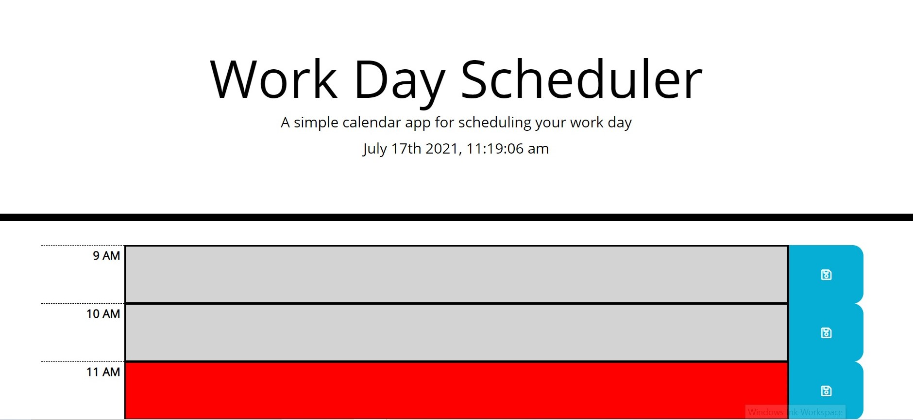
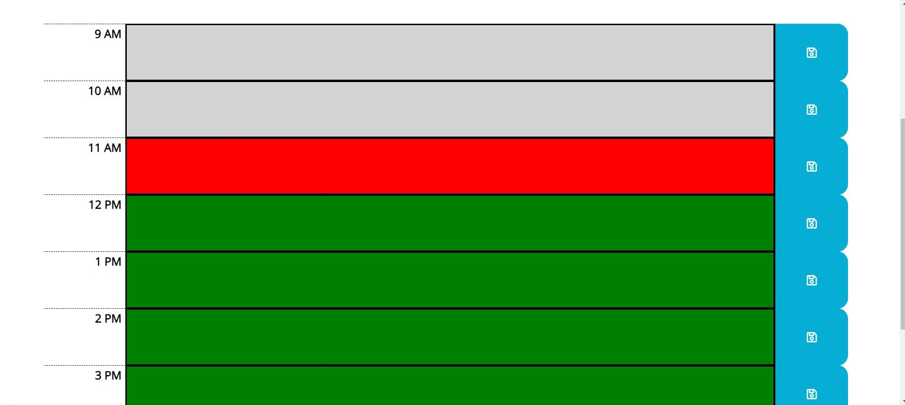

# Work Day Scheduler

## Description

Calendar application that allows a user to save events for each hour of the day. This app runs in the browser and feature dynamically updated HTML and CSS powered by jQuery.

Below are screenshots of some of the features for reference.

- Work Day Scheduler Homepage.

  

- Timeblocks will change depending on the hour of the day.

  

## Website

https://andybuzzi.github.io/work-day-scheduler/
